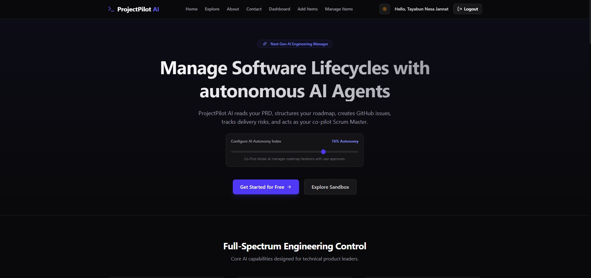

<div align="center">

# 🤖 ProjectPilot AI

### Your Autonomous AI Engineering Manager

*Transform raw requirements into structured roadmaps, GitHub issues, sprint plans, and delivery insights — powered by multi-agent AI.*

[](https://projectpilot-ai.vercel.app/)
&nbsp;
[](https://nextjs.org/)
&nbsp;
[](https://expressjs.com/)
&nbsp;
[](https://langchain-ai.github.io/langgraph/)
&nbsp;
[](https://www.mongodb.com/)
&nbsp;
[](https://vercel.com/)

<br/>



</div>

---

## 📖 Table of Contents

- [✨ Overview](#-overview)
- [❌ The Problem & ✅ The Solution](#-the-problem---the-solution)
- [🚀 Key Features](#-key-features)
  - [🧠 AI Agent Capabilities](#-ai-agent-capabilities)
  - [📋 Project & Sprint Management](#-project--sprint-management)
  - [🔗 GitHub Integration](#-github-integration)
  - [📊 Analytics & Intelligence](#-analytics--intelligence)
- [📦 Tech Stack & Architecture](#-tech-stack--architecture)
- [🗂️ Project Structure](#-project-structure)
- [🛠️ Installation & Setup](#-installation--setup)
  - [Prerequisites](#prerequisites)
  - [Backend Setup](#backend-setup)
  - [Frontend Setup](#frontend-setup)
- [⚙️ Environment Variables](#-environment-variables)
- [🚢 Production Deployment](#-production-deployment)
- [🤝 Contributing & License](#-contributing--license)

---

## ✨ Overview

**ProjectPilot AI** is an enterprise-grade, AI-powered engineering management platform built with **Next.js 16 (App Router)**, **Express.js**, and **LangGraph multi-agent orchestration**.

It acts as your autonomous Scrum Master and Engineering Manager — reading your Product Requirement Documents (PRDs), auto-generating user stories and GitHub issues, predicting sprint delivery risks, analyzing code health, and producing executive-level reports. Built for modern engineering teams who want the power of AI without sacrificing control.

---

## ❌ The Problem & ✅ The Solution

> **Engineering teams waste 30–40% of their time on project management overhead instead of shipping.**

| ❌ Traditional Bottlenecks | ✅ ProjectPilot AI's Solution |
| :--- | :--- |
| **Manual PRD → Ticket Translation** taking days | Upload a PRD and get structured user stories & GitHub issues in seconds via AI agents |
| **Reactive Sprint Planning** with no delivery forecasting | AI sprint prediction flags at-risk tasks before they derail your timeline |
| **Siloed Standup Notes** scattered across tools | Auto-generated standup summaries with blockers, wins, and next steps |
| **No Tech Stack Guidance** for new projects | AI-driven architecture recommendations based on PRD signals and project context |
| **Slow Code Reviews** bottlenecking delivery | Automated code review agent that surfaces quality issues with actionable feedback |
| **Opaque Release Health** with no single source of truth | Release readiness reports combining GitHub sync, gap analysis, and health scores |

---

## 🚀 Key Features

### 🧠 AI Agent Capabilities

| Agent / Service | Description |
| :--- | :--- |
| **LangGraph Orchestrator** | Multi-step reasoning agent that coordinates sub-tasks across the platform |
| **Scrum Master Agent** | Runs daily standups, identifies blockers, and surfaces team progress automatically |
| **Code Review Agent** | Analyses code diffs and pull requests for quality issues and best practice violations |
| **Gap Analysis Service** | Compares implemented features against PRD requirements to surface coverage gaps |
| **Stack Recommendation Engine** | Parses PRD text and recommends an optimal tech stack with confidence scores |
| **Semantic Search Service** | Embeds and searches project context for relevant decisions, tasks, and docs |
| **User Memory Service** | Remembers user preferences and past decisions to personalise AI interactions |
| **Sprint Prediction Service** | Forecasts sprint delivery probability based on task complexity and team velocity |
| **Smart Assignment Service** | Suggests task assignments based on developer skill patterns and workload |
| **Reprioritization Service** | Re-ranks backlog items using urgency, impact, and dependency signals |
| **Executive Report Generator** | Produces C-suite-ready PDF reports on project health, velocity, and risks |
| **Release Readiness Service** | Aggregates health metrics to produce a Go/No-Go release readiness score |
| **Standup Service** | Synthesizes daily updates into concise, actionable standup notes |
| **Meeting Notes Service** | Summarises raw meeting transcripts into structured decision logs |

### 📋 Project & Sprint Management

- **One-Click Project Creation** from a PRD upload (PDF, DOCX, or TXT)
- **AI-Generated User Stories** broken down into epics and tasks with acceptance criteria
- **Sprint Board** with drag-and-drop task management and status tracking
- **Roadmap View** with milestone planning and dependency mapping
- **Decision Log** capturing all architectural and product decisions in one place
- **Notification Center** for real-time alerts on risk events and sprint milestones

### 🔗 GitHub Integration

- **GitHub Sync** — push generated issues directly to your repository
- **PR Monitoring** — track open pull requests and their review status
- **Issue Lifecycle Tracking** — sync issue state back from GitHub into ProjectPilot

### 📊 Analytics & Intelligence

- **Project Health Dashboard** with velocity trends and burndown charts (Recharts)
- **Delivery Risk Heatmap** surfacing at-risk tasks and sprint slippage predictions
- **AI Autonomy Index** — configure how much initiative agents take autonomously
- **Explore Page** — browse public projects as inspiration and templates

---

## 📦 Tech Stack & Architecture

### Frontend

| Layer | Technology |
| :--- | :--- |
| **Framework** | Next.js 16 (App Router) + React 19 |
| **Language** | TypeScript 5 |
| **Styling** | Tailwind CSS v4 |
| **Animations** | Framer Motion |
| **Data Fetching** | TanStack Query (React Query v5) + Axios |
| **Forms** | React Hook Form + Zod |
| **Charts** | Recharts |
| **Icons** | Lucide React |
| **Fonts** | Geist Sans / Geist Mono (via `next/font`) |

### Backend

| Layer | Technology |
| :--- | :--- |
| **Runtime** | Node.js + Express 4 |
| **Language** | TypeScript 5 |
| **AI Orchestration** | LangGraph + LangChain |
| **AI Models** | Google Gemini (`@google/genai`), Anthropic Claude, OpenAI |
| **Database** | MongoDB (Mongoose ODM) |
| **Auth** | JWT (`jsonwebtoken`) + bcryptjs |
| **File Uploads** | Multer (PDF, DOCX, TXT) |
| **PDF Generation** | PDFKit |
| **Observability** | LangSmith Tracing |
| **Validation** | Zod |

### Architecture Overview

```
┌─────────────────────────────────────────────────────────────────┐
│                      Next.js 16 Frontend                        │
│  App Router · React 19 · TanStack Query · Framer Motion         │
└────────────────────────────┬────────────────────────────────────┘
                             │ REST API (Axios)
┌────────────────────────────▼────────────────────────────────────┐
│                   Express.js Backend API                         │
│  Auth Middleware · Route Controllers · Zod Validation            │
└────────────────────────────┬────────────────────────────────────┘
                             │
         ┌───────────────────┼───────────────────┐
         │                   │                   │
┌────────▼──────┐   ┌────────▼──────┐   ┌───────▼────────┐
│  LangGraph    │   │   MongoDB     │   │  GitHub API    │
│  Multi-Agent  │   │   Atlas DB    │   │  (Issues/PRs)  │
│  Orchestrator │   │               │   │                │
└───────┬───────┘   └───────────────┘   └────────────────┘
        │
┌───────▼────────────────────────────────────────────────┐
│              AI Model Layer                             │
│  Google Gemini · Anthropic Claude · OpenAI GPT          │
└────────────────────────────────────────────────────────┘
```

---

## 🗂️ Project Structure

```
projectpilot-ai/
├── frontend/                    # Next.js 16 App
│   └── src/
│       └── app/
│           ├── page.tsx         # Landing page
│           ├── dashboard/       # Main project dashboard
│           ├── projects/[id]/   # Individual project workspace
│           ├── explore/         # Public project discovery
│           ├── blog/            # Engineering blog
│           ├── about/           # About page
│           ├── login/           # Auth pages
│           └── register/
│
└── backend/                     # Express.js API
    └── src/
        ├── app.ts               # Express entry point
        ├── models/              # Mongoose schemas
        │   ├── Project.ts
        │   ├── Task.ts
        │   ├── User.ts
        │   ├── UserMemory.ts
        │   ├── GithubSync.ts
        │   ├── DecisionLog.ts
        │   ├── MeetingNote.ts
        │   ├── Roadmap.ts
        │   ├── SprintHistory.ts
        │   ├── Report.ts
        │   ├── Document.ts
        │   └── Notification.ts
        ├── services/            # AI agent services
        │   ├── langgraphAgent.ts
        │   ├── scrumMasterAgent.ts
        │   ├── codeReviewAgent.ts
        │   ├── gapAnalysisService.ts
        │   ├── stackRecommendationService.ts
        │   ├── semanticSearchService.ts
        │   ├── memoryService.ts
        │   ├── sprintPredictionService.ts
        │   ├── smartAssignmentService.ts
        │   ├── reprioritizationService.ts
        │   ├── executiveReportService.ts
        │   ├── releaseReadinessService.ts
        │   ├── standupService.ts
        │   ├── meetingNotesService.ts
        │   ├── githubService.ts
        │   ├── healthService.ts
        │   └── recommendationEngine.ts
        ├── controllers/
        ├── routes/
        ├── middlewares/
        ├── repositories/
        ├── validators/
        └── config/
```

---

## 🛠️ Installation & Setup

### Prerequisites

- **Node.js** v18+ and **npm** v9+
- **MongoDB** — local instance or [MongoDB Atlas](https://www.mongodb.com/atlas) URI
- **Google Gemini API Key** — [Get one here](https://aistudio.google.com/app/apikey)
- **GitHub Personal Access Token** — for issue sync (optional)
- **Anthropic & OpenAI API Keys** — optional, for multi-model support

---

### Backend Setup

```bash
# 1. Navigate to the backend directory
cd backend

# 2. Install dependencies
npm install

# 3. Copy the environment template and fill in your values
cp .env.example .env

# 4. Start the development server (runs on http://localhost:5000)
npm run dev
```

---

### Frontend Setup

```bash
# 1. Navigate to the frontend directory
cd frontend

# 2. Install dependencies
npm install

# 3. Create a local env file pointing to the backend
echo "NEXT_PUBLIC_API_URL=http://localhost:5000" > .env.local

# 4. Start the development server (runs on http://localhost:3000)
npm run dev
```

Open [http://localhost:3000](http://localhost:3000) in your browser.

---

## ⚙️ Environment Variables

Create a `.env` file in the `backend/` directory using the provided `.env.example` as a template:

```env
# Server
PORT=5000

# Database
MONGODB_URI=mongodb://127.0.0.1:27017/projectpilot

# Authentication
JWT_SECRET=your-super-secret-jwt-key-here
CLIENT_URL=http://localhost:3000

# Google OAuth (optional)
GOOGLE_CLIENT_ID=your-google-client-id
GOOGLE_CLIENT_SECRET=your-google-client-secret

# AI Model Keys
GEMINI_API_KEY=your-gemini-api-key-here
ANTHROPIC_API_KEY=your-anthropic-api-key-here
OPENAI_API_KEY=your-openai-api-key-here

# LangSmith Tracing (optional but recommended)
LANGSMITH_TRACING=true
LANGSMITH_ENDPOINT=https://api.smith.langchain.com
LANGSMITH_API_KEY=your-langsmith-api-key-here
LANGSMITH_PROJECT=projectpilot-ai
```

> ⚠️ **Never commit your `.env` file.** It is already listed in `.gitignore`.

---

## 🚢 Production Deployment

This project is deployed on **Vercel** for both the frontend and the backend (serverless).

### Deploy Frontend

```bash
cd frontend
npx vercel --prod
```

### Deploy Backend

```bash
cd backend
npx vercel --prod
```

> Both `frontend/` and `backend/` contain `vercel.json` configuration files ready for deployment. Set all environment variables in your **Vercel project dashboard** before deploying.

---

## 🤝 Contributing & License

Contributions, issues, and feature requests are welcome!

1. **Fork** the repository
2. **Create** your feature branch: `git checkout -b feature/amazing-feature`
3. **Commit** your changes: `git commit -m 'Add some amazing feature'`
4. **Push** to the branch: `git push origin feature/amazing-feature`
5. **Open a Pull Request**

---

<div align="center">

Built with ❤️ using Next.js, LangGraph & Google Gemini

</div>
